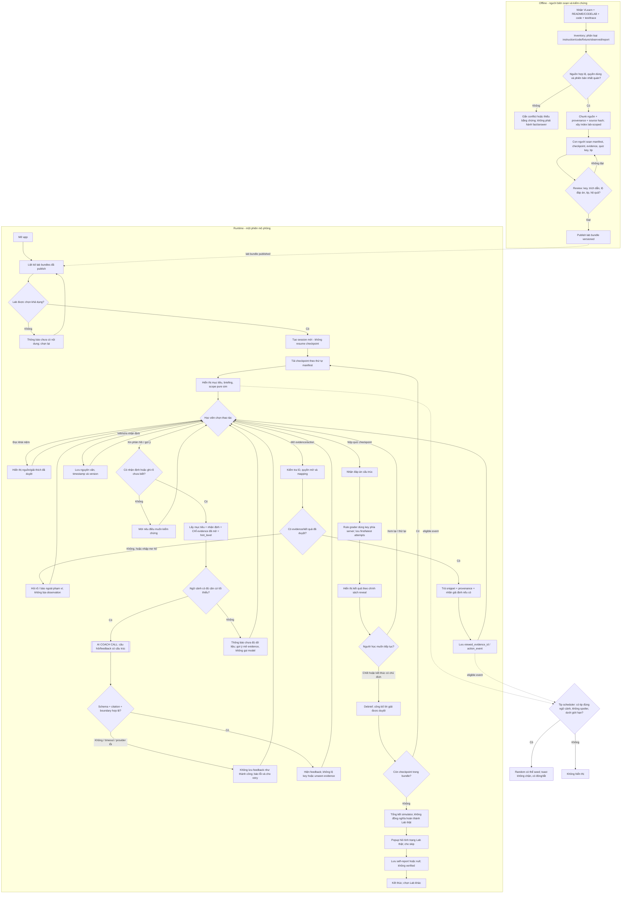

# Lab Simulator — Thiết kế workflow thống nhất (đề nghị duyệt)

**Ngày:** 2026-09-18. **Trạng thái:** bản thiết kế để người dùng rà soát, **chưa phải spec nộp đã sửa, implementation plan hay phần mềm đã chạy**. **Phân loại Superpowers:** architectural. **Quy mô:** một lab có dữ liệu thật, cấu trúc mở rộng theo manifest; mục tiêu prototype với coding assistant trong khoảng 2 giờ là *timebox*, không phải cam kết nghiệm thu.

**Tài liệu đối chiếu:** `labsim_submission/spec.md` (bản CP4 đã nộp), `spec_under_review(2).md`, `lab_simulator_workflow_features(1).md`, `lab_situation(1).md`, tài liệu VLearn Day 03 `Pasted text(1).txt`, `README.md`, `CODELAB.md`, `app(1).py`, `tools(1).py`, `mcp_server(1).py`, `trace_eval.md`, `trace_waterfall.json`, và thiết kế Case Detective `docs/superpowers/specs/2026-09-18-labsim-case-detective-mvp-design.md`. Các tài liệu có thể mô tả **những phiên bản Lab 3 không đồng nhất**; xem §5.1. Chưa xác nhận quyền tái phân phối nguyên văn bộ câu hỏi VLearn ra ngoài phạm vi được phép.

## 0. Nội dung có thể chuyển vào `spec.md` §4 — Thiết kế

**Một câu mô tả sản phẩm.** Lab Simulator cho học viên chọn bài Lab, học và luyện tập qua các checkpoint bám mạch hướng dẫn, chủ động khám phá tình huống kỹ thuật và bằng chứng, nhận phản hồi AI về lập luận, kiểm tra kiến thức bằng đáp án đã được biên soạn và tự khai tình trạng hoàn thành Lab thực tế.

**Lát cắt một câu (1 người, 1 việc, 1 quyết định AI, 1 kết quả).** Một học viên AI20K chọn Lab 3 và xử lý một tình huống kỹ thuật tại checkpoint; AI chọn phản hồi chất vấn hoặc gợi ý phù hợp với nhận định và các bằng chứng học viên đã xem; học viên giải quyết một câu kiểm tra có đáp án xác nhận và nhìn lại lập luận của mình.

**Giới hạn:** pure simulation (không đọc repo học viên, chạy terminal, sửa code, gửi bài hay xác minh kết quả thật); người biên soạn kiểm tra nội dung/hệ quả, AI chỉ diễn giải và phản hồi trong phạm vi nguồn. Không có hai chế độ “Học hiểu/Thử sức”; người mới có briefing, người ôn tập có thể đi thẳng vào hoạt động cùng một workflow. Chọn Lab là thao tác thật, nhưng MVP chỉ mở Lab 3 đã có nội dung. **Load/resume từ checkpoint được hoãn.** Các thẻ tip xuất hiện ngẫu nhiên *trong tập tip được duyệt, đúng ngữ cảnh* và không chặn giao diện. Kết quả quiz có answer key tách khỏi nhận xét AI; popup cuối Lab chỉ lưu **tình trạng tự khai**, không xác thực VLearn.

**Lưu ý khi nhập vào spec nộp trước:** đây là nội dung đề xuất thay thế/điều chỉnh **§4 và changelog**, không được lén thay quality bar §7 đã khóa tại CP4. §1–§3 vẫn cần bằng chứng pain/impact đáng tin cậy; bản workflow không tự chứng minh hiệu quả học tập.

## 1. Quyết định thiết kế, phạm vi và phương án cân nhắc

### 1.1. Quyết định đã chốt trong hội thoại

1. Một workflow cho học viên mới, đang làm Lab, hoặc ôn tập; **không phân luồng chế độ**.
2. Chọn Lab và đi theo mạch checkpoint biên soạn từ VLearn/README/CODELAB hoặc LAB-GUIDE; khám phá bên trong mỗi checkpoint có thể phi tuyến.
3. Con người dùng coding assistant đọc Lab theo mạch thực hiện, **biên soạn và duyệt** scenario, evidence, đáp án, tip; runtime không tự sinh “sự thật”.
4. AI phản hồi nhận định dựa trên bằng chứng học viên đã mở; cấp gợi ý mạnh hơn **chỉ khi được học viên yêu cầu**. Không yêu cầu giả thuyết ban đầu phải sai.
5. Quiz cấu trúc có answer key duyệt trước, chấm bằng rule; AI nhận xét đoạn giải thích riêng, không tính là điểm deterministic.
6. Popup cuối Lab lưu `lab_completion_self_reported`, bao gồm bỏ qua/không trả lời; không có verification.
7. Tips/tricks/facts ngẫu nhiên theo sự kiện và ngữ cảnh, nội dung đã duyệt; không tiết lộ đáp án sớm.
8. **Pending:** tải/tiếp tục phiên từ checkpoint đã lưu; không tạo API/UI giả cho khả năng đó trong MVP.

### 1.2. Ba cách dựng engine và lý do chọn

| Cách | Giá trị | Chi phí/rủi ro | Quyết định |
|---|---|---|---|
| A — LLM tự đọc Lab, tự tạo scenario, hệ quả, đáp án trong runtime | Dễ thêm Lab mới về mặt thao tác | Dễ bịa test/log, làm lệch quy định, rất khó chấm nhất quán | **Không dùng làm nguồn sự thật** |
| B — Case/checkpoint được duyệt + index nguồn thật + một AI coach | Có nội dung kiểm chứng, interaction linh hoạt, dễ gắn provenance | Công biên soạn; retrieval cần test | **Kiến trúc chọn** |
| C — Digital twin chạy code hoặc tool thật của học viên | Quan sát hệ quả thật | Sandboxing, credentials, chi phí, bảo mật, kiểm thử vượt timebox | **Ngoài MVP** |

**Không mặc định nhiều agent.** Một gọi model có kiểm soát để coach, cộng công cụ đọc nguồn/chấm rule, là đủ cho quyết định AI trong lát cắt. Một model thứ hai, agent tự phân công hay prompt chain nhiều tầng chỉ được bổ sung khi có lỗi cụ thể chứng minh một call không đủ.

### 1.3. Sản phẩm và bản demo không phải cùng phạm vi

- **Tầm nhìn:** nhiều Lab, các checkpoint đa dạng, thư viện scenario và tip, learner có thể học/ôn/luyện bất cứ thời điểm nào.
- **MVP:** 1 Lab khả dụng (đề nghị Lab 3), ít nhất 2 checkpoint *học tập* nội dung đã duyệt để thể hiện mạch Lab; tối thiểu 1 checkpoint có scenario khám phá + AI coach + quiz. Nếu nhóm chỉ kịp biên soạn **1 checkpoint** đáng tin, demo phải nói thật và không diễn giả có cả Lab.
- **Phần bị cắt trước khi giảm tính trung thực:** thêm Lab, nhiều dạng câu hỏi (matching/ordering nếu thiếu answer key), resume từ checkpoint, tự sinh case, vector DB, multi-agent, dashboard; **không cắt** provenance, AI call thật, phân tách mock/thật, một kiểm thử đáp án có key.

## 2. Flowchart chi tiết — ingestion/curation và runtime

Sơ đồ thể hiện hai quá trình khác nhau: **người biên soạn chuẩn bị nguồn trước demo**, và **học viên tương tác lúc chạy**. Nhánh chấm điểm, gợi ý, tip, AI lỗi và trạng thái tự khai đều là những nhánh tường minh. Không có “resume checkpoint” trong flow hiện tại.

**Giải thích luồng:** tuyến tính là **thứ tự các checkpoint**; phi tuyến là học viên đọc/điều tra/sửa nhận định/xin phản hồi bên trong một checkpoint. Việc xem một evidence không biến đổi code hoặc lab thật. `Action` chỉ có hệ quả nếu nhóm đã cung cấp mapping/hệ quả có nhãn thích hợp; nếu không, hệ thống không tạo observation tuỳ ý.

## 3. Workflow chi tiết ngang mức thiết kế triển khai

### 3.1. Các đơn vị và ranh giới

| Module logic | Trách nhiệm | Nhận → trả | Không làm |
|---|---|---|---|
| `ingestion` (offline) | Đọc nguồn được cấp phép, phân loại, chunk giữ đường dẫn/dòng, hash, inventory | Lab source → source manifest, evidence chunks | Tự xác nhận report là run thật, tự sửa xung đột |
| `curation/publisher` | Validate gói học do người biên soạn phê duyệt | Lab manifest/checkpoints/scenarios/questions/tips → published bundle hoặc lỗi chi tiết | Sinh đáp án chưa xác minh ở runtime |
| `retrieval` (read-only) | Tìm đoạn nguồn **trong đúng `lab_id` và `bundle_version`** | Query + filter → top-k có ID, path, locator, source kind | Thay evidence cố định của case bằng kết quả tìm kiếm bất chợt |
| `session` | Quản lý state phiên hiện tại và event history | lab/checkpoint/action → state mới | Khẳng định tiến độ thực tế, resume xuyên phiên trong MVP |
| `scenario/evidence` | Ánh xạ thẻ/action được duyệt sang nội dung | scenario_id/evidence_id → fact + provenance | Chạy code, tạo log ngoài fixture |
| `coach` | Lấy ngữ cảnh đã mở, gọi model, validate output | hypothesis + opened evidence + hint_level → câu chất vấn/feedback | Chấm quiz, tự nâng hint, biết hidden answer |
| `quiz` | Chấm cấu trúc bằng key duyệt | response + versioned key → correctness/attempt | Dùng AI làm trọng tài điểm số |
| `tips` | Chọn tip phù hợp theo sự kiện, chống lặp | checkpoint + shown IDs + seed → tip hoặc none | Sinh sự thật mới, chặn ô nhập liệu |
| `completion` | Hỏi/lưu tình trạng hoàn thành Lab thực tế | lựa chọn hoặc skip → self_report/null | Gắn cờ verified, truy cập VLearn |

**Luồng dữ liệu:** `nguồn → inventory/chunks/index → human-reviewed bundle → phiên học → coach (read-only source) / quiz (private answer key) → debrief → self-report`. Không tạo chuỗi agent tự cấp quyền cho mình.

### 3.2. Ingestion và source-of-truth

1. **Nguồn:** VLearn Day 03 (`Pasted text(1).txt`) là tài liệu mạch học, knowledge map, câu hỏi; `README.md`/`CODELAB.md` là yêu cầu lab; `src/*.py` xác định code của **đúng phiên bản**; `config/test_cases.example.json` là fixture; `trace_eval.md` và `trace_waterfall.json` cần phân loại template/report/observed sau kiểm chứng. Nhập bản sao **được phép sử dụng**; không publish raw chatlog, private data, `.env` hoặc API keys.
2. **Inventory:** lưu `source_id`, `lab_id`, `source_kind`, `origin`, `path`, `sha256`, `version`, `review_status`. Không OCR/pdf ingestion/video ingestion trong MVP; text/Markdown/Python/JSON đủ cho demo. Source bytes không giải mã được → warning, không thay thế bằng text lỗi.
3. **Chunk/provenance:** mỗi chunk có `evidence_id`, `source_id`, `path`, `start_line`, `end_line`, `text`, `source_kind`, `sha256`. Đường dẫn/citation phải dẫn về đúng văn bản, không cấp citation chỉ từ lời AI. Cấm lập chỉ mục dữ liệu bí mật. Chunks nhiều lab không trộn.
4. **Retrieval:** tìm kiếm lexical BM25 đơn giản trên index *nếu đủ thời gian* và benchmark bằng queries gán gold. Quan trọng: các thẻ evidence cốt lõi đã được tác giả gắn **ID trực tiếp** nên demo không phụ thuộc vào tìm kiếm đúng/sai trong runtime; BM25 chỉ phục vụ “đọc thêm/tìm nguồn”. Không cần embeddings/vector DB. Không có kết quả → nói chưa tìm thấy, không gọi model để bù.
5. **Review/publish:** chỉ case/question/tip có `review_status=approved`, `source_version` nhất quán và mọi `source_ref` tồn tại mới vào danh mục học viên. Khi source hash thay đổi, đánh dấu bundle stale; không lặng lẽ dùng key cũ.

**Xung đột đã thấy cần giải quyết khi biên soạn Lab 3:** VLearn Day 03 được dán trong `Pasted text(1).txt` nói TASK 2.1 hoàn thiện Python dispatcher trong `src/tools.py`, trong khi `CODELAB.md` của repo nguồn nói TASK 2.1 hoàn thiện `MCPAcademicServer.call_tool()` ở `src/mcp_server.py` và code đính kèm còn TODO này. Không tự tuyên bố nguồn nào đúng cho mọi lớp/phiên bản. Nhóm phải chọn một version/bundle và annotate sự khác biệt; **không xuất câu hỏi chấm về vị trí TODO 2.1 khi chưa rõ version**.

### 3.3. Content model tối thiểu

- `LabManifest`: `lab_id`, `title`, `bundle_version`, `source_manifest_sha256`, `status`, `checkpoint_ids[]` (ordered), `scope_label`.
- `LearningCheckpoint`: `id`, `lab_id`, `ordinal`, `title`, `learning_objective`, `briefing`, `source_refs[]`, `scenario_ids[]`, `question_ids[]`, `tip_ids[]`. **Khác** `official_lab_milestone` (mốc VLearn “CHECKPOINT 1/2/3”) — có thể map bằng `official_milestone_id?` nhưng không đồng nhất hai khái niệm.
- `Scenario`: `scenario_id`, `brief`, `supported_actions[]`, `evidence_ids[]`, `reference_explanation`, `status`; action ID ánh xạ đến một quan sát đã duyệt hoặc trả `unsupported`.
- `Evidence`: `evidence_id`, `title_neutral`, `excerpt`, `source_ref`, `source_kind`, `epistemic_label` (`verified_observation` / `instruction` / `code` / `reported` / `hypothetical`), `release_rule`.
- `Question`: `question_id`, `type` (`single_select`, `multi_select`; `matching`/`ordering` chỉ khi đã hỗ trợ), `prompt`, `options`, `answer_key` **server-only**, `explanation`, `source_refs[]`, `answer_reviewed_by`, `review_status`. Nếu VLearn text chỉ có câu hỏi/đáp án từng phần thì **chưa publish để auto-grade**.
- `Tip`: `tip_id`, `text`, `source_refs[]`, `checkpoint_tags[]`, `spoiler_for[]`, `review_status`, `min_interval_events`.
- `Session`: `session_id`, `lab_id`, `bundle_version`, `current_checkpoint_id`, `viewed_evidence_ids[]`, `hypothesis_versions[]`, `hint_level`, `attempts[]`, `tips_seen[]`, `tips_disabled`, `session_phase`, `lab_completion_self_reported?`, `self_reported_at?`.

**Bảo mật key:** API chỉ gửi `Question` đã loại `answer_key`, `reference_explanation`, các evidence chưa mở. Grader và debrief ở server; ẩn bằng CSS không phải bảo mật. Nếu MVP frontend tĩnh không có backend thì không được tuyên bố key được giữ bí mật.

### 3.4. Hợp đồng thao tác runtime (không bắt buộc dùng chính xác tên route)

| Operation | Request chính | Điều kiện / nhánh lỗi | Response / event |
|---|---|---|---|
| `list_labs()` | Không | Không có bundle duyệt → empty-state | Lab công khai và trạng thái availability |
| `create_session(lab_id)` | ID lab | Không tồn tại/chưa duyệt → 404/409 | session mới ở checkpoint đầu; **không resume** |
| `open_checkpoint(session_id, id)` | checkpoint theo thứ tự đã mở | ID không thuộc Lab hoặc nhảy tới nội dung bị khóa → 400/403 | briefing, public scenario, quiz prompt (no key) |
| `reveal_evidence(session_id, evidence_id)` | ID được scenario cấp | unknown/khác Lab/chưa được phép → 400/403 | excerpt có provenance; append event |
| `submit_hypothesis(session_id, text)` | Chuỗi hoặc ghi rõ chưa biết | Empty/too long → validation; text injection là data | hypothesis version được lưu nguyên văn |
| `coach_feedback(session_id, requested_hint_level)` | User chủ động gọi | Missing hypothesis/evidence → hướng dẫn chưa đủ; provider fail → 503/retry; schema/citation sai → lỗi không lưu feedback | feedback có `claim`, `question`, `source_ids[]`, `uncertainty` |
| `submit_quiz(session_id, question_id, answer)` | ID, lựa chọn trong tập hợp hợp lệ | Unknown option, cross-lab, thiếu key duyệt → reject | first/latest attempt, đúng/sai theo key; reveal theo policy |
| `next_checkpoint(session_id)` | Xác nhận tiếp tục | Hết checkpoint → summary; không khóa bằng điểm | chuyển theo ordinal; ghi completion trong Simulator riêng |
| `get_tip(session_id, event_id)` | event + seed state | Không đủ điều kiện/có nguy cơ spoiler/đã tắt → none | tip đã duyệt hoặc none; chỉ hiện tại safe event |
| `set_lab_completion(session_id, value|null)` | `completed`, `in_progress`, `not_started`, `prefer_not_to_say` hoặc skip | Sai enum → reject; không được dùng làm verified | lưu self-report hoặc null, có thể sửa trong phiên |

**Persistence:** session lưu trong bộ nhớ ứng dụng cho demo là đủ; refresh/server restart có thể mất phiên, phải báo rõ. Không viết luồng restore/checkpoint loader trong MVP. Nếu chọn persistence để chống refresh sau này, đó là feature riêng và cần test migration/versions.

### 3.5. AI orchestration — một quyết định AI, không mặc định agent tự trị

**Preconditions:** học viên đã ghi một hypothesis (kể cả “chưa biết”) và mở ít nhất một evidence phù hợp *hoặc* đang hỏi gợi ý tìm bằng chứng; nếu chưa mở evidence, coach chỉ có thể hỏi xem gì tiếp chứ không phán nguyên nhân. **Prompt không chứa** answer key, reference explanation, raw secret, unseen evidence hoặc dữ liệu từ Lab khác. “Không đủ bằng chứng” không được nói thành lỗi hệ thống.

**Một call coach đề xuất:** xây `grounded_context = {lab_id, checkpoint_id, objective, learner_claim, viewed_evidence:[{id, excerpt, source_ref}], hint_level, previous_feedback_summary?}` → prompt yêu cầu output schema ổn định `{observation_acknowledged, unsupported_inference, next_question, cited_evidence_ids, uncertainty}`. Chính sách hint: mức 0 hỏi dựa trên evidence; mức 1 chỉ lỗ hổng; mức 2 gợi ý phép kiểm tra; chỉ người học có quyền tăng mức. Nếu câu hỏi là giải thích code cụ thể, ưu tiên `source_ref` code cùng bundle hoặc phản hồi không đủ nguồn. **Không tự gọi các tool viết/execute**.

**Validator:** kiểm JSON/schema, citation thuộc `viewed_evidence_ids`, độ dài/các trường bắt buộc, không khẳng định chạy test thật; kiểm rò rỉ answer bằng golden cases + review, không tuyên bố regex có thể bảo đảm chống leak về ngữ nghĩa. Sai schema hoặc timeout: không cập nhật tiến độ/điểm, cho retry; nếu model unavailable, quiz và đọc tài liệu vẫn chạy, coach hiện thông báo dịch vụ chưa sẵn sàng (**không tráo câu canned thành AI thật**).

**Retrieval/tool use:** internal read-only `get_evidence(evidence_id)`, `search_source(lab_id, query)` tùy nhu cầu người học; response phải mang source refs. Đây là **application tools**, không phải một agent được quyền tuỳ tiện gọi terminal/MCP/GitHub. Chỉ thêm second prompt step (“explain after debrief”) khi một lỗi thử nghiệm cụ thể đòi hỏi; không dùng prompt chaining nhiều tầng như KPI kiến trúc.

### 3.6. Rule grading, reveal và self-report

- Hỗ trợ `single_select` và `multi_select` bằng so khớp ID/set đã normalize, không fuzzy text. Matching/ordering của VLearn được ghi **candidate content**, không cấp điểm cho tới khi có key, kiểu chấm và UI phù hợp.
- Lưu `first_attempt` bất biến, `latest_attempt`, `attempt_count` và `answer_revealed` riêng. Sau khi cho xem đáp án, mọi lần làm lại ghi `post_reveal=true` và **không gọi là pre/post learning gain**.
- Chính sách đề xuất: sau lần đầu hiện đúng/sai và lời nhắc xem lại; learner có thể tiếp tục hoặc chủ động kết thúc checkpoint; debrief mở lời giải khi học viên chốt checkpoint, **không khóa bằng điểm đúng**.
- Tổng kết hiện `simulator_checkpoint_completed` (workflow event), quiz result (rule), `lab_completion_self_reported` (tự khai) — **không có `lab_completion_verified` trong MVP**. Popup hỏi một lần ở cuối Lab, có nút skip, không làm điều kiện mở summary; sửa lựa chọn trong phiên được phép.
- **Metrics học tập:** số câu đúng lần đầu là một kết quả quiz cụ thể, không chứng minh nhân quả rằng Simulator giúp học tốt hơn. AI feedback là đánh giá định tính, không gọi là deterministic. `hint_count`, `evidence_viewed`, self-report là dữ liệu hành vi/tự khai, không xếp hạng năng lực.

### 3.7. Tips/tricks/facts theo ngữ cảnh

- Bộ nội dung được con người duyệt, gắn `lab_id`, `checkpoint_id/tags`, source ref. Loại: giải thích khái niệm, tên và vai trò hàm, mẹo đọc trace, phân biệt fixture và run thật; tip phải đúng **phiên bản source**.
- Trigger sau `checkpoint_opened` hoặc `evidence_viewed` tại điểm UI an toàn; dùng random có seed tùy chọn cho test, giới hạn 1 tip / checkpoint hoặc sau vài event, không lặp cho tới khi hết pool, cho tắt.
- Filter `spoiler_for` và `review_status` trước random; không hiện tip về root cause/answer trước debrief. Không pop-up chặn lúc đang gõ; hiển thị toast/card với đóng và xem nguồn.
- Tip không gọi AI runtime. Nếu sau này muốn giải thích động đoạn code tùy ý, đó là một capability AI mới, không âm thầm nhập vào scheduler.

### 3.8. Ngoại lệ và acceptance gates

| Mã | Tình huống | Hành vi kiểm chứng được |
|---|---|---|
| X01 | Lab chưa publish / sai version / bundle stale | Không hiển thị như khả dụng; không lấy nguồn Lab khác |
| X02 | VLearn và CODELAB/code mâu thuẫn | Gắn conflict; không chấm fact chưa giải quyết |
| X03 | Quiz thiếu key hoặc key chỉ suy từ đáp án learner | Không publish để chấm; hiện ở nguồn tham khảo nếu có quyền |
| X04 | Evidence ID lạ/khác Lab/không được mở | Từ chối; không lộ hidden solution |
| X05 | AI được hỏi khi chưa có evidence | Hỏi cần kiểm tra gì, không dựng kết luận |
| X06 | AI timeout/bad JSON/citation sai/claim vượt nguồn | Báo lỗi hoặc nhận xét không đủ căn cứ; giữ state; không tính AI call pass |
| X07 | Học viên sửa hypothesis/đã đúng ngay từ đầu | Lưu phiên bản; không ép đổi để có “plot twist” |
| X08 | Tip leak đáp án/lặp/không liên quan | Scheduler lọc/skip và cho tắt |
| X09 | AI hoặc người học đòi chạy code, sửa repo, submit hộ | Nêu pure simulation; không có writable tool |
| X10 | Self-report skip hoặc chọn completed | Lưu null/chọn tự khai; không gắn verified |
| X11 | Refresh/server restart khi chưa có persistence | Thông báo phiên demo không khôi phục; không giả vờ resume |
| X12 | User input/evidence chứa prompt injection hoặc secret | Data không được nâng thành instruction; không log/đẩy secret sang API |

**Chốt eval:** giữ nguyên quality bar khóa trong `labsim_submission/spec.md` §7 (đề xuất cũ ≥16/20 cùng các hard bars); phải đối chiếu việc chuyển trọng tâm từ scenario generator sang coach với **golden-set mới theo cùng chuẩn/threshold**, ghi changelog và công bố điểm không tương đương nếu đo hai tác vụ khác nhau. Không đổi ngưỡng sau khi nhìn kết quả. Track D còn yêu cầu kiểm tra học tập với học viên thực tế; chương trình nêu ≥5 bạn học một đoạn bằng prototype, không chỉ click UI (`track-d-adaptive-interactive-learning.md`). Những người này chưa được xác nhận đã tham gia test.

## 4. Mức độ triển khai và chuẩn bị cho implementation plan

**Đường găng đề xuất:** (1) duyệt đúng version nguồn Lab 3 + quyền hiển thị → (2) người biên soạn tạo 1 bundle có ít nhất một checkpoint hoàn chỉnh và một quiz key verified → (3) dựng workflow UI + grader/sessions → (4) coach API thật, kiểm chứng input không chứa key/unseen evidence → (5) tip scheduler + self-report → (6) test scenario và golden set + demo. Nếu còn thời gian, thêm checkpoint thứ hai và lexical search; **không xây multi-agent trước khi chạy được đường găng**.

**Điểm dừng trong Superpowers:** tài liệu này là *design spec*. Sau khi người dùng duyệt **nội dung file**, mới gọi skill `writing-plans` và lập plan có tác vụ/file/test/command/checkpoint cho coding agent. Chưa triển khai, chưa khẳng định có index thật hoặc AI call đã thành công. Không commit nếu chưa có repo Git được cung cấp.
